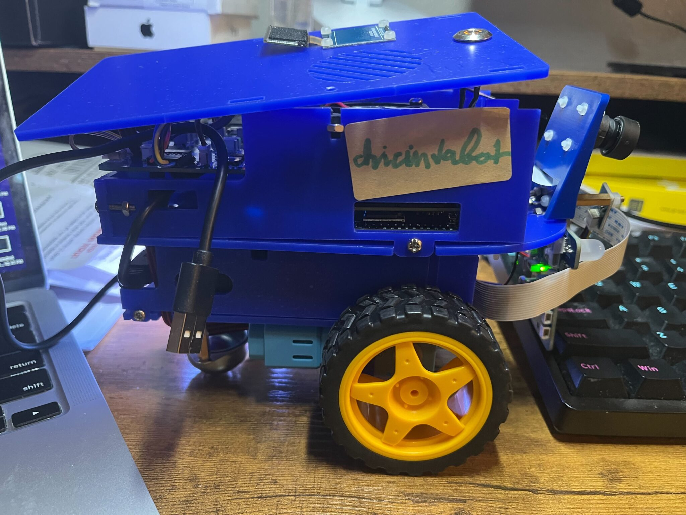
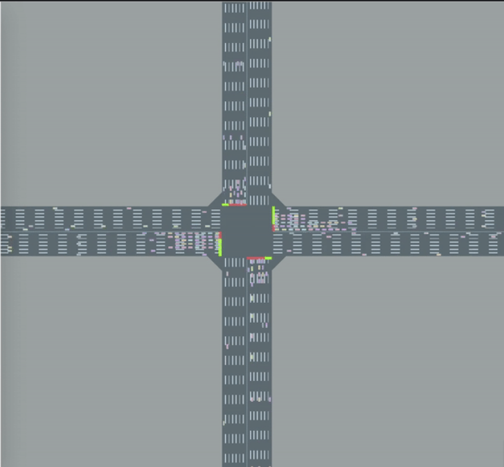
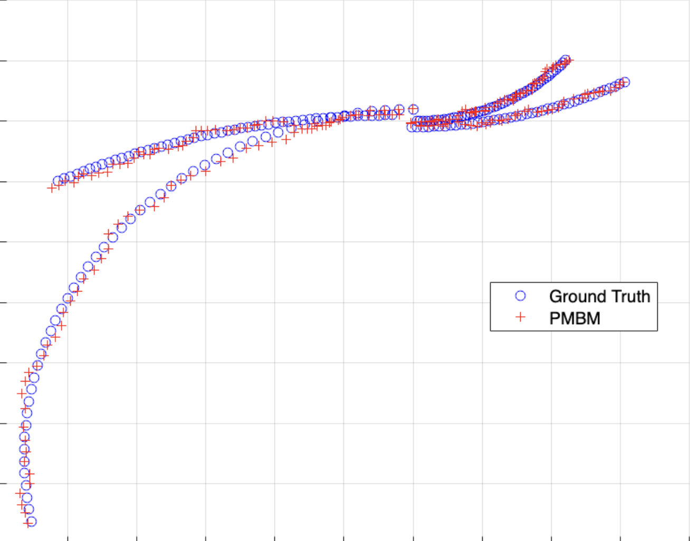

# 👋 Hello, I’m **Khoa (Albert) Vo**

🎓 **Computer Science & Mathematics** student at **Arizona State University (ASU)**  
💡 Passionate about **Robotics**, **Deep Learning**, and **Representation Learning**  
🌏 Originally from **Vietnam**, now based in **Arizona, USA**  
🎸 *Fun fact: I play a mean guitar!*

---

## 🚀 Current Research & Projects

---

<!-- Duckiebot Image -->

### **Duckiebot Autonomous Driving — FURI Project**
> [Duckiebot Autonomous Driving (FURI)](https://github.com/Chickeninvader/duckiebot_project)

Developed an end-to-end autonomous driving pipeline for the **Duckiebot** platform.

* Implemented lane-following & obstacle avoidance via **Offline RL** and **Imitation Learning**  
* Integrated **ROS**, **Docker**, and real-time feedback control  
* Funded by **DOE, Amazon, TSMC, NSF** under the *FURI Research Grant (2025)*

---

<!-- UGAT Image -->

### **DaRL-LibSignal / UGAT — Uncertainty-Aware Grounded Action Transformation**
> [DaRL-LibSignal / UGAT](https://github.com/DaRL-LibSignal/UGAT)

Contributed to **uncertainty-aware** multi-agent RL for traffic signal control.

* Implemented UGAT from **CDC 2023**  
* Improved sim-to-real robustness with confidence calibration  

---

<!-- DAAD Image -->

### **DAAD-RISE Germany — Traffic Accident Detection**
> [DAAD-RISE-Germany](https://github.com/Chickeninvader/DAAD-RISE-Germany)

Developed a **video classification model** for traffic accident prediction.

* Integrated **Video Swin Transformer** with **LSTM**  
* Achieved **0.75 F1-score** across dashcam datasets  
* Supported by the **DAAD-RISE Fellowship (2024)**

---

<!-- PyEDCR Image -->

### **PyEDCR — Neuro-Symbolic Error Detection (Lab V2)**
> [PyEDCR (Meta-Cognitive Neuro-Symbolic Learning)](https://github.com/lab-v2/PyEDCR)

Designed a **metacognitive neuro-symbolic system** for error detection and correction.

* Combined Logic Tensor Networks & Set Optimization  
* Improved model reliability and F1 by **5%**  
* Accepted at **CIKM 2024**

---

<!-- Multi-object Tracking Image -->

### **MultiObjectTracking — Coursework Series**
> [MultiObjectTracking](https://github.com/Chickeninvader/MultiObjectTracking)

Created a MATLAB-based suite for **multi-object tracking**:

* Includes Kalman Filters, JPDA, advanced multi-target tracking  
* Developed for Chalmers University’s *Automotive Tracking Systems* course  

---
## 🧾 Publications & Posters

### **Conference Papers**

J. S. Kricheli, **K. Vo**, A. Datta, S. Ozgur, P. Shakarian.  
**“Error Detection and Constraint Recovery in Hierarchical Multi-Label Classification without Prior Knowledge.”**  
*Proceedings of the 33rd ACM International Conference on Information and Knowledge Management (CIKM), October 2024.*  
[Paper Link](https://arxiv.org/abs/2407.15192)

---

J. Turnau, L. Da, **K. Vo**, F. Al Rafi, S. Bachiraju, T. Chen, H. Wei.  
**“Joint-Local Grounded Action Transformation for Sim-to-Real Transfer in Multi-Agent Traffic Control.”**  
*Reinforcement Learning Conference (RLC), 2025.*  
[Paper Link](https://arxiv.org/abs/2507.15174)

---

Y. Zhang, **K. Vo**, L. Da, T. Chen, X. Liu, H. Wei.  
**“Poster Abstract: Reproducible and Low-cost Sim-to-Real Environment for Traffic Signal Control.”**  
*14th ACM/IEEE International Conference on Cyber-Physical Systems (ICCPS), April 2025.*  
[Paper Link](https://doi.org/10.1145/3716550.3725161)

---

### **Poster Presentations**

**K. Vo**, H. Wei.  
**“Bridging the Sim-to-Real Gap in Autonomous Systems Using Learning from Demonstration.”**  
*Fulton Undergraduate Research Initiative (FURI) Symposium, April 2025.*  
[Poster Link](https://forge.engineering.asu.edu/furiproject/bridging-the-sim-to-real-gap-in-autonomous-systems-using-learning-from-demonstration/)

---

## 🧠 Skills

**Languages**: Python · C++ · MATLAB · R · Java · Julia  
**Tools**: Linux · ROS · Docker · Git  
**Frameworks**: PyTorch · TensorFlow · Ray · Scikit-learn · OpenCV  
**Domains**: Robotics · Reinforcement Learning · Computer Vision · Sim-to-real Transfer  

---

## 🎓 Teaching & Awards

**Teaching**  
* Undergraduate TA — Computer Organization, Intro to cyber security (2023–2025)  
* Math & CS Tutor (2025–Present)

**Awards**  
* 🏅 Dean’s List (2022–Present)  
* 🎓 New American University Scholarship — $7,250/semester  
* 🌍 DAAD-RISE Grant (2024)  
* 🔬 FURI Research Grant (2025)

---

## 📧 Get in Touch

📧 **ngocbach@asu.edu**  
🔗 [LinkedIn](https://www.linkedin.com/in/khoa-al-vo/)  
💻 [GitHub](https://github.com/Chickeninvader)

---

<h4 align="center">✨ Thanks for Visiting! ✨</h4>
